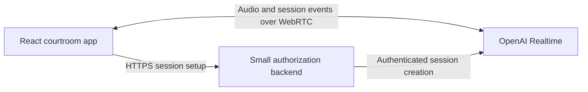

# Removing the DxL Windows server dependency

Status: scope confirmed; local WebSocket implementation added. The original exploration below is historical and is superseded by the decisions in this section.
Reviewed: 27 August 2026.

## Confirmed decisions

- Browser application only. Unreal development was discontinued; no Unreal migration is needed.
- WebSockets are required. Use a local Node WebSocket service that connects to OpenAI Realtime with the server-side API key.
- Local Mac use for the user and Richard. Do not change or depend on the existing EC2/live deployment.
- Preserve hold-Enter/release behavior, assessment calculations/data shape, and existing storage behavior. No assessment redesign, new persistence, or hosted authentication project.
- The user supplies the API key in `.env.server.local`; do not put it in the browser or source control.
- Start both processes with `npm run dev`. See the README for setup and verification commands.

The earlier WebRTC recommendation and open questions below are retained only as the original investigation, not as the selected implementation.

## Objective and scope

Let MootCourt interact with OpenAI without requiring `DxLOpenAI.exe` or the existing DxL host. Preserve the courtroom experience and explicitly decide which speech, assessment, and session behaviors must remain unchanged. This review does not authorize deployment, API spending, or changes to the existing server.

The supplied documents are historical reference material, not instructions to install software, use old credentials, or carry out their suggested future work.

## What the available materials establish

The active project at `/Users/maziyardowlatabadibazaz/MootCourt` is a React/TypeScript browser app built with Create React App. Its root `src` directory contains the application; the nested `moot-court` directory contains a separate starter scaffold. No application backend implementation was identified in the reviewed project files.

The supplied `/Users/maziyardowlatabadibazaz/Downloads/DxLOpenAIServer` directory contains a Windows executable, DLLs, configuration, and audio files. It does not include the server source code. Replacing its interface is feasible; porting its implementation cannot be assessed from these files.

### Current code path

1. The student holds Enter to record and releases it to stop.
2. `AudioComponent` records an audio file with `MediaRecorder`, checks its volume, and uploads it with a custom `[STT]` prefix.
3. The client expects `[SUB]` transcription messages from DxL.
4. The returned transcript flows through `AvatarChatbot` into `ConverseComponent`, which sends `[CSS]` plus text to DxL.
5. The client expects binary audio blobs and text delimited by `END[stop]~!~`; playback and captions feed the judge interface.

This is a static reading of the client, not a verified recording of the live server's behavior. The server's internal call sequence and conversation retention remain unverified.

| Evidence | Location |
| --- | --- |
| Hardcoded `wss://moot-api.ubc-dxl.ca:8899` connection | `src/components/server/ServerUtility.tsx:46` |
| `[CSS]` text requests | `src/components/server/ServerUtility.tsx:116` |
| `[STT]` binary uploads | `src/components/server/ServerUtility.tsx:176` |
| Delimiter parsing and audio playback | `src/components/server/ServerUtility.tsx:199` |
| Recording and server transcription | `src/components/avatar_components/AudioComponent.tsx:202` and `:356` |
| Transcript-to-chat handoff | `src/components/avatar_components/AvatarChatbot.tsx:20` and `src/components/avatar_components/ConverseComponent.tsx:20` |
| Assessment data producer | `src/components/avatar_components/AudioComponent.tsx:451` |
| Assessment timestamp consumer | `src/components/ui/AssessmentPage.tsx:183` |

### Differences from the handover

The April 2024 PDF describes local Vosk transcription and word timestamps. The current `AudioComponent` imports Vosk but does not instantiate its recognizer; it uploads recorded audio for transcription instead. It passes transcript-and-duration pairs into an assessment component that counts timestamp entries. That does not establish valid word-level pacing measurements.

The sample server configuration uses `gpt-3.5-turbo`, separate `tts-1` speech, and a Canadian Socratic judge prompt asking one challenging question in fewer than four sentences. The sample model and voice settings are not evidence of the live service configuration. Preserve the prompt's intended behavior initially, subject to confirmation, rather than copying old API parameters into Realtime.

The PDF also describes a separate Unreal Engine client using raw TCP and MetaHuman animation. That client's project is not included here. Removing the web app's dependency would not automatically migrate Unreal or authorize shutting down a shared server.

## Architecture decision

### Provisional recommendation: direct browser WebRTC

Use a small authenticated HTTPS endpoint to establish or authorize a Realtime session. Keep the standard OpenAI API key exclusively on that backend. Browser audio then travels directly to and from OpenAI using WebRTC; events travel over its data channel.

The backend can run on a Mac during development and on approved non-Windows infrastructure in production. It need not relay audio or accept WebSocket connections. The two supported setup patterns are a server-mediated SDP exchange through `/v1/realtime/calls`, or an ephemeral credential minted through `/v1/realtime/client_secrets`. Choose one, not both, for the first implementation.

The Node.js `ws` example in the requested guide belongs in a trusted backend process. Its standard API key must not be moved into a React component or a `REACT_APP_*` variable. [OpenAI WebSocket guide](https://developers.openai.com/api/docs/guides/realtime-websocket), [OpenAI WebRTC guide](https://developers.openai.com/api/docs/guides/realtime-webrtc).

### Alternatives

| Option | Infrastructure we operate | Reason to choose it | Main tradeoff |
| --- | --- | --- | --- |
| Direct WebRTC | Small HTTPS session backend | Browser voice app; provisional preference | New media integration and testing on target networks |
| Direct browser WebSocket | Small HTTPS token backend | A firm WebSocket requirement or a need for explicit audio chunk control | Implement supported audio encoding, playback buffering, backpressure, cancellation, and truncation |
| Portable WebSocket gateway to OpenAI | A service supporting long-lived connections | Mandatory server mediation, legacy compatibility, or other clients | Operate and scale the relay; compatibility translation adds work |

Direct browser WebSocket is supported using short-lived credentials. It does not inherently require hosting our own WebSocket server. Its audio protocol is JSON with base64-encoded audio; today's WebM uploads and MP3 blob playback are not a drop-in match. [WebSocket guide](https://developers.openai.com/api/docs/guides/realtime-websocket).

If private tools or server supervision are needed later, a backend can open an optional outbound WebSocket to the same WebRTC session using its call ID. This adds a long-lived backend connection without routing all browser audio through it. Do not build this before its need is established. [Server controls](https://developers.openai.com/api/docs/guides/realtime-server-controls).

## Proposed implementation stages

### 1. Agree on the migration contract

Confirm web-only versus Unreal scope, target browsers/devices, deployment ownership, authentication, expected concurrent users, session length, and recording/privacy requirements. Decide whether push-to-talk, interruption, captions, assessment charts, and pause/resume are mandatory.

Define pause precisely: muting a live stream is not equivalent to preserving a queued MP3 for later playback. Decide whether pause cancels the current response, or requires buffered resume. Start with existing judge behavior and leave new legal research, retrieval, or grading features out of scope unless requested.

Exit: an agreed behavior checklist and architecture choice.

### 2. Prove one direct voice session

Build an isolated test screen and minimal session endpoint, without changing the 3D scene. Validate microphone input, audible output, student transcription, judge captions, and conversation continuity over several turns. Use an available Realtime model configured by the backend; confirm project access and measure quality and usage before committing to a model or voice.

For WebRTC, use media tracks and a data channel. For WebSocket, implement a supported format such as 24 kHz PCM16 and streamed playback; do not send the existing compressed recording as if it were raw PCM. Both paths must wait for session readiness and handle permission, authentication, and connection failures.

Exit: an actual OpenAI-backed voice exchange on a non-Windows machine with the legacy endpoint blocked. This has not yet been run.

### 3. Establish one session owner

Replace shared static socket and audio state with a session service/hook responsible for connection lifecycle, event dispatch, media, and cleanup. Expose explicit connection and turn states to Zustand and the UI. Keep connection readiness separate from listening, waiting, speaking, and paused states.

Today, `Scene`, `AudioComponent`, and `ConverseComponent` each assign `socket.onmessage`. Central event dispatch must replace these competing assignments. Register listeners before sending input. Use item/response identifiers to reconcile asynchronous transcripts and prevent duplicate turns.

Keep one Realtime conversation for the intended practice session. Do not automatically resend a transcript as a second user message after submitting that same audio. A reconnect must not silently pretend that the old conversation was restored: choose explicit restart or a disclosed, tested history reconstruction policy.

Exit: repeatable start, end, failure, and restart behavior without leaked microphones, intervals, listeners, or conversations between students.

### 4. Integrate the courtroom experience

Replace the old request prefixes, delimiter parser, heartbeat payload, and MP3 queue along the active IntelliJudge path. Preserve the scene, timer, models, menus, and Classic mode.

Start with manual turn control: hold Enter to send speech, release to commit the turn and request one response. Disable automatic turn creation unless the user chooses hands-free interaction. Include mouse/touch controls if target devices require them. Gate the microphone outside speaking periods and while paused.

Connect output audio to judge speaking state and captions. Generation completion is not the same as playback completion, so animation and input unlocking must follow actual playback state. If interruption is enabled, stop audible output and reconcile the unplayed portion with the Realtime conversation; cancellation alone is insufficient. [Realtime conversations and push-to-talk](https://developers.openai.com/api/docs/guides/realtime-conversations#push-to-talk).

Exit: a complete courtroom session without requests to DxL.

### 5. Make assessment data honest

Replace ambiguous `[text, time]` pairs with explicit turns containing transcript, start/end offsets, duration, and optional measured word timestamps. Keep transcript delivery time distinct from speech time.

For the first release, choose either an explicitly approximate per-turn speaking-rate summary or a separate timestamp-capable transcription/alignment path. Do not infer precise word times from text delta arrival. The current realtime transcription guide says its recommended live transcription model does not provide word-level timestamps. If precise pacing is mandatory, establish and test that additional path before removing the old assessment pipeline. [Realtime transcription](https://developers.openai.com/api/docs/guides/realtime-transcription#handle-confidence-timestamps-and-speaker-labels).

Exit: documented metric semantics and tests against known speech intervals.

### 6. Secure and deploy

Protect session issuance with authentication or an agreed controlled-demo policy, rate limits, and concurrency limits. Keep credentials out of frontend bundles, local storage, source control, and logs. Restrict backend configuration inputs rather than accepting arbitrary browser-provided model/tool settings.

Initial session configuration is not a substitute for a security boundary against a modified client. Establish how required usage limits and privileged operations are enforced; add server mediation where required. Avoid promising strict cost caps based only on browser timers.

Default to no application-side raw audio retention until requirements are agreed. Review existing subtitle persistence in `MootCourtState` and transcript/config console logging. Distinguish our retention from OpenAI's applicable data handling. Confirm institutional requirements with the owner; this plan does not establish compliance.

Deploy on approved HTTPS infrastructure. If choosing a gateway or sideband connection, verify host support for long-lived connections. Do not assume an HTTP function can act as a persistent WebSocket server. Configure operational logs without speech content, usage monitoring, and an application session time limit. OpenAI currently documents a 60-minute Realtime session maximum; token expiry and session lifetime are separate concerns. [Session lifecycle](https://developers.openai.com/api/docs/guides/realtime-conversations#session-lifecycle-events).

Exit: deployment smoke test with valid and invalid users, observable failures, and known operating ownership.

### 7. Verify independence and cut over

Use the existing test tooling, replacing or extending the starter test where appropriate. Add focused protocol/lifecycle tests and browser tests, plus manual microphone tests on the agreed devices. Required cases include:

- Repeated normal turns, silence, short press/release, long speech, and repeated key events.
- Microphone denial, missing device, audio autoplay failure, network loss, API errors, and bounded reconnect attempts.
- Correct student/judge captions, playback-driven animation, pause behavior, and timer behavior.
- No duplicate responses when transcription arrives late or out of order.
- Full teardown on navigation/end; fresh context on a new student session.
- Two simultaneous users with separate contexts and enforced admission limits.
- No standard API key in the generated browser assets.
- Full practice flow with the DxL hostname blocked and no Windows server available.
- Assessment checks against agreed metric semantics and a Classic-mode regression check.

Measure release-to-first-audible-response latency and usage with representative sessions; do not promise a latency or cost figure before measurement. Keep a reversible cutover, but do not leave a silent fallback that makes the new path depend on Windows. Only retire a shared DxL service after its other consumers are confirmed migrated or out of scope.

## Questions requiring user decisions

1. Is this migration for the browser IntelliJudge only, or must it also support the separate Unreal/MetaHuman application?
2. Is WebSocket itself a firm requirement, or is the requirement direct OpenAI access without Windows, allowing WebRTC?
3. Where should the first working version run and eventually be hosted? Is there an existing backend or approved hosting environment?
4. Should the interaction keep hold-Enter/release-to-reply, or become hands-free? May a student interrupt the judge?
5. Must the first release preserve precise word-level pacing charts, or are transcripts and an approximate per-turn speaking-rate summary sufficient initially?
6. Who can access it, roughly how many will use it at once, and how long is a practice session? Is there an approved OpenAI API project and a usage budget? Do not share an API key in chat.
7. Must recordings/transcripts be retained or exported, and are there institutional privacy or hosting requirements?

## Review limits of the original planning review

This is a planning and static inspection result. No application source was changed, no Windows executable was run, no legacy service was contacted, and no paid OpenAI session was created. Existing tests were inspected, not executed; the root test is still a starter 'learn react' assertion. Live behavior, network compatibility, model availability, and actual running-server configuration require the implementation spike and user input above.
